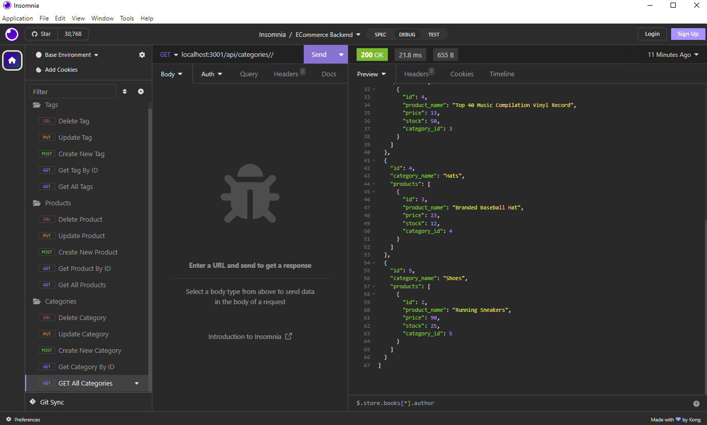

# ECommerce

## Description
Backend for an e-commerce site

## Table of Contents 

- [Installation](#installation)
- [Usage](#usage)
- [Credits](#credits)
- [License](#license)

## Installation

You can access this project by clicking the following link: https://github.com/TheRealMi/ECommerce

## Usage
1. Clone repo to your computer
2. Open the code in a new integrated terminal
3. Use mysql to run the schema by typing "source db/schema.sql"
4. Install necessary packages by opening a new terminal window and typing "npm i"
5. Initialize the seeds by typing "npm run seed"
6. Run the application in the terminal by typing "npm start"
7. Use insomnia to test routes

Watch the video below to see a walkthrough of the application:

## Credits

[Coding Bootcamp](https://courses.bootcampspot.com)

[Professor Phil Loy](https://github.com/philliploy)

[w3 Schools](https://www.w3schools.com/)

## License

Please refer to the license on the repo
